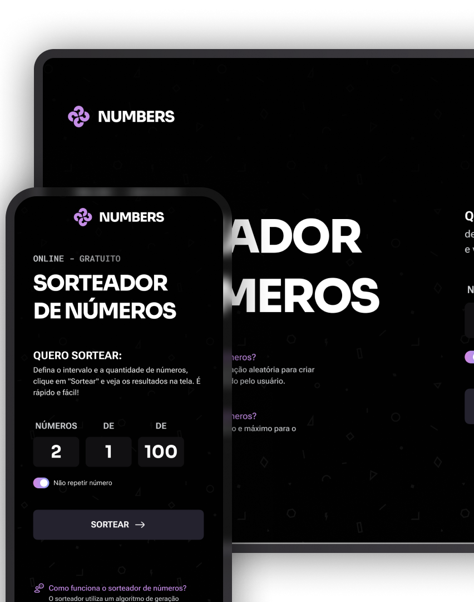

<h1 align="center">🎲 Sorteador de Números</h1>

  Uma aplicação web para sortear números de forma simples e personalizada.
   
  Projeto desenvolvido durante a <strong>Formação Full Stack da Rocketseat</strong>,
  com foco na prática de HTML, CSS e JavaScript.

  <a href="#-tecnologias">Tecnologias</a>&nbsp;&nbsp;&nbsp;|&nbsp;&nbsp;&nbsp;
  <a href="#-projeto">Projeto</a>&nbsp;&nbsp;&nbsp;|&nbsp;&nbsp;&nbsp;
  <a href="#-funcionalidades">Funcionalidades</a>&nbsp;&nbsp;&nbsp;|&nbsp;&nbsp;&nbsp;
  <a href="#-como-utilizar">Como utilizar</a>&nbsp;&nbsp;&nbsp;|&nbsp;&nbsp;&nbsp;
  <a href="#-aprendizados">Aprendizados</a>&nbsp;&nbsp;&nbsp;|&nbsp;&nbsp;&nbsp;
  <a href="#-layout">Layout</a>

 

  

## 🚀 Tecnologias

Esse projeto foi desenvolvido com as seguintes tecnologias:

- **HTML5** — estrutura da página, campos e formulário;
- **CSS3** — estilização, layout responsivo e animações;
- **JavaScript** — lógica do sorteio, validações e interação com a página;
- **Git e GitHub** — versionamento e armazenamento do projeto;
- **Figma** — referência visual para o desenvolvimento da interface.

## 💻 Projeto

O **Sorteador de Números** é uma aplicação que permite gerar números aleatórios de acordo com as preferências do usuário.

É possível informar a quantidade de números desejada, definir o início e o fim do intervalo e escolher se os resultados podem se repetir.

Após o sorteio, o formulário dá lugar a uma tela de resultados. Os números aparecem com uma animação de entrada, e o botão **Sortear novamente** permite realizar outro sorteio sem precisar recarregar a página.

O projeto também conta com um contador que identifica a sequência dos sorteios realizados enquanto a página permanece aberta.

O desenvolvimento teve como objetivo colocar em prática conceitos de JavaScript e transformar um layout do Figma em uma interface funcional e responsiva.

[Acesse o projeto finalizado, online](https://vkoithi.github.io/sorteador-numeros/)

## ✨ Funcionalidades

- Definir quantos números serão sorteados;
- Escolher os valores mínimo e máximo do intervalo;
- Permitir ou impedir números repetidos;
- Impedir sorteios com o valor mínimo maior que o máximo;
- Avisar quando não há números suficientes para um sorteio sem repetição;
- Exibir os resultados com animação de entrada;
- Contabilizar os sorteios realizados;
- Voltar ao formulário para realizar um novo sorteio;
- Adaptar a interface para computadores e dispositivos móveis.

## 🎮 Como utilizar

**1. Escolha a quantidade**

Informe quantos números deseja sortear no campo **Números**.

**2. Defina o intervalo**

Preencha os campos **De** e **Até** com os limites do sorteio.

**3. Configure a repetição**

Ative a opção **Não repetir número** caso queira que cada número apareça apenas uma vez no mesmo sorteio.

**4. Realize o sorteio**

Clique em **Sortear** para visualizar os resultados.

**5. Sorteie novamente**

Clique em **Sortear novamente** para retornar ao formulário e iniciar outro sorteio.

> **Exemplo:** ao solicitar 3 números entre 1 e 10, com a opção de não repetir ativada, a aplicação gera três números distintos dentro desse intervalo.

## 🧠 Aprendizados

Durante o desenvolvimento deste projeto, pratiquei conceitos fundamentais de JavaScript e desenvolvimento web.

### Manipulação do DOM

Utilizei métodos como `querySelector()`, `createElement()` e `appendChild()` para acessar elementos da página e criar os números sorteados dinamicamente.

Também trabalhei com `textContent` e `classList` para atualizar os resultados e alternar entre a exibição do formulário e a tela de sorteio.

### Lógica de programação

A lógica do sorteio utiliza `Math.random()` e `Math.floor()` para gerar números inteiros dentro do intervalo informado.

Com o laço `while`, o programa continua gerando números até alcançar a quantidade solicitada. Quando a opção de não repetir está ativada, o método `includes()` verifica se um número já foi sorteado.

### Validação de dados

Implementei verificações para impedir intervalos invertidos e quantidades incompatíveis com o sorteio sem repetição.

O formulário também utiliza recursos de validação do HTML, como `required`, `min` e `step`.

### Arrays e funções

Utilizei um array para armazenar os números gerados e o método `forEach()` para percorrê-los e criar os elementos exibidos na página.

### CSS e responsividade

Trabalhei com Flexbox, Grid e media queries para adaptar a disposição dos elementos a diferentes tamanhos de tela.

Também utilizei `@keyframes` para criar a animação dos resultados e organizei os estilos em arquivos separados, facilitando a manutenção do projeto.

## 📂 Como executar o projeto

Para executar a aplicação localmente:

1. Clone o repositório ou baixe os arquivos do projeto.
2. Abra a pasta do projeto no Visual Studio Code ou em outro editor.
3. Abra o arquivo `index.html` no navegador.

Se preferir, utilize a extensão **Live Server** para visualizar as alterações durante o desenvolvimento.

O projeto utiliza HTML, CSS e JavaScript e não exige instalação de dependências.

## 📱 Responsividade

A aplicação possui layouts adaptados para desktop e dispositivos móveis.

Na versão para celular, o formulário ou a área de resultados aparece logo abaixo do título, seguido pelas informações explicativas sobre o sorteador.

Os números sorteados se reorganizam conforme o espaço disponível, preservando a visualização dos resultados e o acesso ao botão **Sortear novamente**.

## 🔖 Layout

O projeto foi desenvolvido com base no layout disponibilizado pela **Rocketseat** no Figma.

  Desenvolvido por <strong>Victor</strong> durante meus estudos em Desenvolvimento Full Stack.

